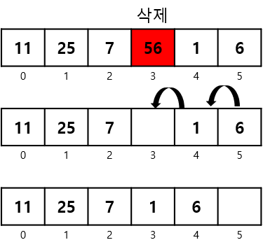

# 배열

## 개요
- 선형 자료구조의 한 종류.
- 선언을 통해 메모리를 미리 할당받아 사용한다.
- 자료형 크기의 저장공간이 배열 크기만큼 할당되어 메모리상에 순차적으로 생성된다.
  
(출처: GeeksforGeeks - https://www.geeksforgeeks.org/array-data-structure/)
- 각 저장공간을 인덱스라고 부르며, 데이터와 인덱스가 1:1로 대응한다.
- 한 배열에는 같은 자료형의 데이터만 저장하고 관리할 수 있다.

### 장점
1. 좋은 검색 성능
    - 찾고자 하는 데이터의 인덱스를 알고 있으면, 해당 인덱스를 활용하여 원하는 데이터에 빠르게 접근할 수 있다.
    - 배열 전체를 탐색하더라도 데이터들이 순차적으로 저장되어 있어 비교적 빠르다.
2. 쉬운 사용
    - 대부분의 프로그래밍 언어에서 기본적으로 지원하므로 쉽게 사용할 수 있다.

### 단점
1. 배열의 크기 변경 불가
    - 배열의 최초 선언시 지정한 크기만큼만 메모리에 할당되고 더 크게 재할당 하려면 다시 선언해야 한다.
    - 배열의 크기(인덱스)를 초과하면 데이터를 추가 저장할 수 없다.
2. 데이터의 삽입이 어려움
    - 선언된 배열의 크기 내에서 빈 공간에 데이터 추가는 간단하지만, 이미 연속적으로 저장되어 있는 데이터 사이에 새로운 데이터를 삽입하려면 삽입하려는 위치 이후의 데이터들을 한 칸씩 뒤로 미는 추가 연산이 필요하다.  
    
    - 배열의 크기 변경이 불가능하기 때문에 포화상태의 배열에는 삽입을 할 수 없다.
3. 데이터의 삭제가 어려움
    - 연속적으로 저장되어 있는 데이터의 중간에서 데이터를 삭제하면 해당 인덱스에 값이 없어 메모리가 낭비될 수 있다.
    - 삭제한 인덱스를 채우려면 뒤에 존재하는 데이터드를 당기는 추가 연산이 필요하다.
    
4. 할당된 메모리의 재사용 불가
    - 배열의 데이터가 꽉 차있지 않아 빈 공간이 생겨도 배열의 메모리로 할당되어 있기 때문에 다른 변수를 선언하더라도 해당 메모리 공간은 사용할 수 없다.
